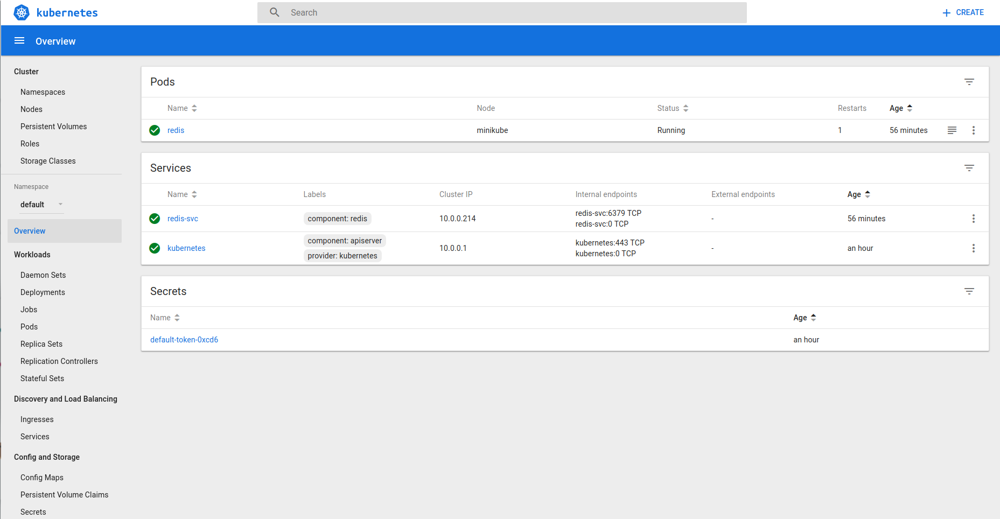
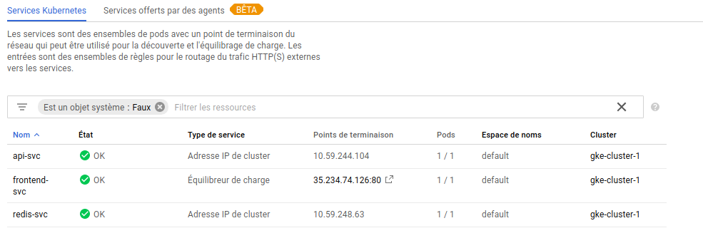

# CLD_kubernetes
## Authors
 * Emmanuel Schmid
 * Wojciech Myszkorowski

## TASK 1 - DEPLOY THE APPLICATION ON A LOCAL TEST CLUSTER

### SUBTASK 1.1 - INSTALLATION OF MINIKUBE
Linux :
curl -Lo minikube https://storage.googleapis.com/minikube/releases/v0.22.0/minikube-linux-amd64 && chmod +x minikube && sudo mv minikube /usr/local/bin/

verif :
$ minikube version
minikube version: v0.22.0


### SUBTASK 1.2 - INSTALLATION OF KUBECTL
Linux :
curl -Lo kubectl https://storage.googleapis.com/kubernetes-release/release/v1.7.5/bin/linux/amd64/kubectl && chmod +x kubectl && sudo mv kubectl /usr/local/bin/

verif :
Client Version: version.Info{Major:"1", Minor:"7", GitVersion:"v1.7.5", GitCommit:"17d7182a7ccbb167074be7a87f0a68bd00d58d97", GitTreeState:"clean", BuildDate:"2017-08-31T09:14:02Z", GoVersion:"go1.8.3", Compiler:"gc", Platform:"linux/amd64"}

### SUBTASK 1.3 - CREATE A ONE-NODE CLUSTER ON YOUR LOCAL MACHINE

nums@UbuntuPearl:~$ kubectl cluster-info
Kubernetes master is running at https://192.168.99.100:8443

To further debug and diagnose cluster problems, use 'kubectl cluster-info dump'.


nums@UbuntuPearl:~$ kubectl get nodes
NAME       STATUS    AGE       VERSION
minikube   Ready     1h        v1.7.5

### OPTIONAL: ACCESS THE KUBERNETES DASHBOARD

$ minikube dashboard




### SUBTASK 1.4 - DEPLOY THE APPLICATION

####DEPLOY THE REDIS SERVICE AND POD

nums@UbuntuPearl:~/Documents/CLD/CLD_kubernetes$ kubectl create -f redis-svc.yaml
service "redis-svc" created
nums@UbuntuPearl:~/Documents/CLD/CLD_kubernetes$ kubectl create -f redis-pod.yaml
pod "redis" created

nums@UbuntuPearl:~/Documents/CLD/CLD_kubernetes$ kubectl get all
NAME       READY     STATUS    RESTARTS   AGE
po/redis   1/1       Running   0          21s

NAME             CLUSTER-IP   EXTERNAL-IP   PORT(S)    AGE
svc/kubernetes   10.0.0.1     <none>        443/TCP    58s
svc/redis-svc    10.0.0.135   <none>        6379/TCP   29s

nums@UbuntuPearl:~/Documents/CLD/CLD_kubernetes$ kubectl describe po/redis
Name:		redis
Namespace:	default
Node:		minikube/192.168.99.100
Start Time:	Tue, 24 Apr 2018 11:29:00 +0200
Labels:		app=todo
		component=redis
Annotations:	<none>
Status:		Running
IP:		172.17.0.4
Containers:
  redis:
    Container ID:	docker://fe61211bc67fe301cf4400fac684323a10f7582301c3e47f988d0ad24e1a501c
    Image:		redis
    Image ID:		docker-pullable://redis@sha256:6b9f935e89af002225c0dcdadf1fd74245b4cc1e3e91222f7e4769c236cf80d4
    Port:		6379/TCP
    Args:
      redis-server
      --requirepass ccp2
      --appendonly yes
    State:		Running
      Started:		Tue, 24 Apr 2018 11:29:08 +0200
    Ready:		True
    Restart Count:	0
    Limits:
      cpu:	10m
    Requests:
      cpu:		10m
    Environment:	<none>
    Mounts:
      /var/run/secrets/kubernetes.io/serviceaccount from default-token-0xcd6 (ro)
Conditions:
  Type		Status
  Initialized 	True 
  Ready 	True 
  PodScheduled 	True 
Volumes:
  default-token-0xcd6:
    Type:	Secret (a volume populated by a Secret)
    SecretName:	default-token-0xcd6
    Optional:	false
QoS Class:	Burstable
Node-Selectors:	<none>
Tolerations:	<none>
Events:
  FirstSeen	LastSeen	Count	From			SubObjectPath		Type		Reason			Message
  ---------	--------	-----	----			-------------		--------	------			-------
  35s		35s		1	default-scheduler				Normal		Scheduled		Successfully assigned redis to minikube
  35s		35s		1	kubelet, minikube				Normal		SuccessfulMountVolume	MountVolume.SetUp succeeded for volume "default-token-0xcd6" 
  32s		32s		1	kubelet, minikube	spec.containers{redis}	Normal		Pulling			pulling image "redis"
  29s		29s		1	kubelet, minikube	spec.containers{redis}	Normal		Pulled			Successfully pulled image "redis"
  29s		29s		1	kubelet, minikube	spec.containers{redis}	Normal		Created			Created container
  27s		27s		1	kubelet, minikube	spec.containers{redis}	Normal		Started			Started container

nums@UbuntuPearl:~/Documents/CLD/CLD_kubernetes$ kubectl describe svc/redis-svc
Name:			redis-svc
Namespace:		default
Labels:			component=redis
Annotations:		<none>
Selector:		app=todo,component=redis
Type:			ClusterIP
IP:			10.0.0.135
Port:			redis	6379/TCP
Endpoints:		172.17.0.4:6379
Session Affinity:	None
Events:			<none>


#### DEPLOY THE TODO-API SERVICE AND POD
Deploy

nums@UbuntuPearl:~/Documents/CLD/CLD_kubernetes$ kubectl create -f api-svc.yaml 
service "api-svc" created


verify the API-Service and Pod (similar to the Redis ones) and verify that they are up and running on the correct ports.
nums@UbuntuPearl:~/Documents/CLD/CLD_kubernetes$ kubectl get all
NAME       READY     STATUS    RESTARTS   AGE
po/redis   1/1       Running   0          9m

NAME             CLUSTER-IP   EXTERNAL-IP   PORT(S)    AGE
svc/api-svc      10.0.0.42    <none>        8081/TCP   10s
svc/kubernetes   10.0.0.1     <none>        443/TCP    10m
svc/redis-svc    10.0.0.135   <none>        6379/TCP   9m

nums@UbuntuPearl:~/Documents/CLD/CLD_kubernetes$ kubectl describe svc/api-svc
Name:			api-svc
Namespace:		default
Labels:			component=api
Annotations:		<none>
Selector:		app=todo,component=api
Type:			ClusterIP
IP:			10.0.0.42
Port:			api-svc	8081/TCP
Endpoints:		<none>
Session Affinity:	None
Events:			<none>

#### DEPLOY THE FRONTEND POD

What value must be set for this URL?

Ajouter un service au pod


### TASK 2 - DEPLOY THE APPLICATION IN KUBERNETES ENGINE

Here is the output of the decriebe command.

```
wojtek@wojtek-XPS-15-9560 ~/Documents/HEIG-VD/CLD/CLD_kubernetes $ ./kubectl describe svc/frontend-svc
Name:			frontend-svc
Namespace:		default
Labels:			component=front
Annotations:		<none>
Selector:		app=todo,component=front
Type:			LoadBalancer
IP:			10.59.245.47
LoadBalancer Ingress:	35.234.74.126
Port:			frontend	80/TCP
NodePort:		frontend	30749/TCP
Endpoints:		10.56.0.10:8080
Session Affinity:	None
Events:
  FirstSeen	LastSeen	Count	From			SubObjectPath	Type		Reason			Message
  ---------	--------	-----	----			-------------	--------	------			-------
  1m		1m		1	service-controller			Normal		EnsuringLoadBalancer	Ensuring load balancer
  10s		10s		1	service-controller			Normal		EnsuredLoadBalancer	Ensured load balancer

```





We had some difficulties to launch the front-svc once every other service was running, we could reach the front-end. It took as a long time to find out that one of our component had the wront label used which caused the intial problem. It was difficult to see as the error was no indicates any problem when lauching the service.

### TASK 3 - ADD AND EXERCISE RESILIENCE
* Use only 1 instance for the Redis-Server. Why?

We only need one server for the database. We do not want to have two database otherwise there would be a conflict.
#### SUBTASK 3.2 - VERIFY THE FUNCTIONALITY OF THE REPLICA SETS
* What happens if you delete a Frontend or API Pod? How long does it take for the system to react?

The system will lauch respectively a new instance of either Frontend or API pod, it takes a couple of seconds to relaunch the new instance.
* What happens when you delete the Redis Pod?
It is the database therefore it does take a bit longer however we are still counting in seconds the relaunch
* How can you change the number of instances temporarily to 3? Hint: look for scaling in the deployment documentation

 To change this parameter we can read the documentation at  
https://kubernetes.io/docs/concepts/workloads/controllers/deployment/

 ```
 kubectl scale deployment frontend —replicas=3
 ```
 
* What autoscaling features are available? Which metrics are used?
* How can you update a component? (see "Updating a Deployment" in the deployment documentation)


